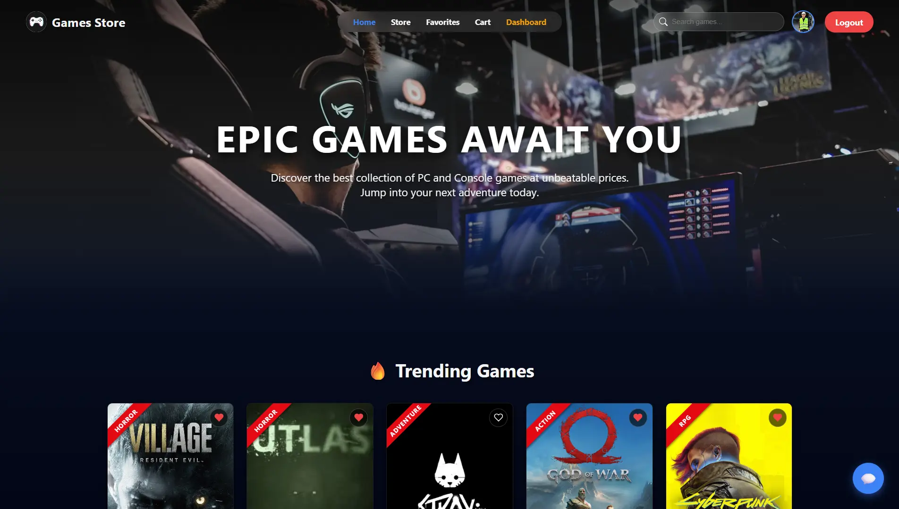

# 🎮 Games Store - E-Commerce Platform API



<div align="center">
  
  
  
  
</div>

<br>

This is the backend service and full-stack integration for a **Games Store** e-commerce platform, developed as the final project for the **NTI (National Telecommunication Institute)** training program. It provides a robust, secure RESTful API and serves a responsive frontend for managing users, games, shopping carts, orders, and community features.


---

## 🌟 Overview
The Games Store platform is designed to deliver a seamless shopping experience for gamers. It handles complex relational data between users, games, and their interactions (favorites, ratings, orders), while maintaining high security standards and clean code architecture.

## ✨ Core Features
* **User Management:** Secure user registration, login, and profile management with encrypted passwords.
* **Role-Based Access Control (RBAC):** Custom middleware to separate standard user privileges from Admin dashboard operations.
* **Games Catalog & Operations:** Full CRUD (Create, Read, Update, Delete) endpoints for managing the games inventory.
* **Shopping Cart & Checkout:** Robust endpoints for users to manage their cart and securely place orders.
* **Interactive Community Features:** Users can rate games, add them to a personal favorites list, and utilize a built-in **Chat** feature.
* **Email Integration:** Automated email services for user notifications.
* **Secure File Uploads:** Integrated `multer` for handling and storing game image assets securely.

---

## 🛠️ Tech Stack
* **Runtime Environment:** Node.js
* **Web Framework:** Express.js
* **Database:** MongoDB with Mongoose ODM
* **Authentication:** JWT (JSON Web Tokens)
* **Security:** bcrypt (Password Hashing)
* **File Management:** Multer
* **Frontend Integration:** HTML/CSS/JS served statically via Express

---

## 📂 Project Structure

The project follows a clean MVC (Model-View-Controller) architecture tailored for Express APIs:

```text
GAMES-STORE-MAIN/
├── chat/                    # Real-time chat logic and configurations
├── controllers/             # Business logic for API endpoints
│   ├── FavGame.controller.js
│   ├── game.controllers.js
│   ├── order.controller.js
│   ├── rate.controller.js
│   └── user.controllers.js
├── dbconnection/            # MongoDB connection setup
├── email/                   # Email notification services
├── Extention/               # Additional utility extensions
├── middleware/              # Custom Express middlewares
│   ├── checkAdmin.js        # Admin authorization check
│   ├── checkEmail.js        # Email validation middleware
│   ├── checkToken.js        # JWT verification
│   ├── gerror.js            # Global error handling
│   ├── hashpass.js          # Password encryption logic
│   ├── multer.js            # File upload configuration
│   └── user.validator.js    # User input validation
├── models/                  # Mongoose Database Schemas
│   ├── cart.js
│   ├── FavGame.js
│   ├── game.js
│   ├── order.js
│   ├── rate.js
│   └── user.js
├── public/                  # Static frontend files served by Node
│   ├── uploads/             # Directory for uploaded game images
│   ├── cart.html
│   ├── chat.html
│   ├── Dashboard.html
│   ├── favorites.html
│   ├── game-details.html
│   ├── index.html
│   ├── login.html
│   └── profile.html
├── routes/                  # Express route definitions
│   ├── cart.route.js
│   ├── favGame.route.js
│   ├── game.routes.js
│   ├── order.route.js
│   ├── rate.route.js
│   └── user.routes.js
├── validation/              # Request payload validation schemas
├── .env                     # Environment variables (Ignored in Git)
├── .gitignore               # Git ignore configurations
├── app.js                   # Express application configuration
├── index.js                 # Entry point of the server
└── package.json             # Backend dependencies and scripts
```

## ⚙️ Installation & Setup
To run this project locally, follow these steps:

1. Clone the repository
```Bash
git clone https://github.com/stevenashrafkamal/Games-Store.git
cd Games-Store
```
2. Install dependencies
```Bash
npm install
```
3. Environment Variables Configuration
Create a .env file in the root directory and add your specific configuration:
```bash
PORT=3000
DB_CONNECTION=your_mongodb_connection_string
JWT_SECRET=your_jwt_secret_key
EMAIL_USER=your email
EMAIL_PASSWORD=your password 
```
4. Start the server
```markdown
4. Start the server
```bash
# For production mode
npm start

# For development mode (if nodemon is installed)
npm run dev
```
# For development mode (if nodemon is installed)
npm run dev
Access the application via http://localhost:3000

## 📡 API Documentation
The API is structured around RESTful principles. Example endpoints include:

Auth: POST /api/users/login, POST /api/users/register

Games: GET /api/games, POST /api/games/add (Admin)

Cart: POST /api/cart/add, GET /api/cart/

Favorites: POST /api/favorites/add, GET /api/favorites/

## 🤝 Contributing
Contributions, issues, and feature requests are welcome!

Fork the Project

Create your Feature Branch (git checkout -b feature/AmazingFeature)

Commit your Changes (git commit -m 'Add some AmazingFeature')

Push to the Branch (git push origin feature/AmazingFeature)

Open a Pull Request

## 👨‍💻 Developer
Steven Ashraf - Full-Stack Developer
